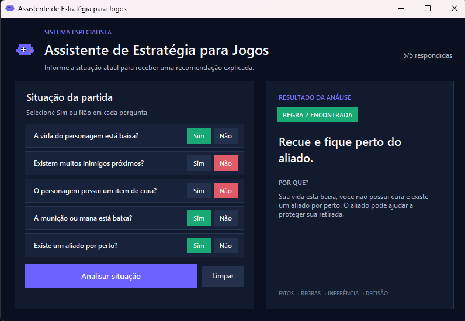

# Projeto de IA - Assistente de Estratégia para Jogos

**Disciplina:** Inteligência Artificial e Machine Learning  
**Autores:** Jefferson Fagundes de Carvalho, Rodrigo Gomes de Carvalho e Michael Jonathan F S Fonseca

## Interface do programa



## 1. Tema escolhido

O projeto é uma IA simples baseada em regras que recomenda a próxima ação de um personagem em um jogo. O sistema faz perguntas sobre a situação atual, transforma as respostas em fatos e compara esses fatos com uma base de conhecimento.

Ao encontrar uma regra compatível, o programa apresenta uma recomendação e explica por que tomou aquela decisão.

## 2. Problema resolvido

Durante uma partida, o jogador precisa considerar várias informações antes de decidir se deve atacar, recuar, procurar recursos ou explorar. O sistema ajuda nessa decisão usando regras definidas previamente pelo grupo.

## 3. Fatos coletados

O programa faz cinco perguntas ao usuário:

1. A vida do personagem está baixa?
2. Existem muitos inimigos próximos?
3. O personagem possui um item de cura?
4. A munição ou mana está baixa?
5. Existe um aliado por perto?

Cada resposta é armazenada como `True` para sim ou `False` para não.

## 4. Regras escritas em português

### Regra 1

**SE** a vida está baixa  
**E** o personagem possui um item de cura  
**ENTÃO** usar o item de cura antes de continuar  
**PORQUE** recuperar vida reduz o risco de ser derrotado.

### Regra 2

**SE** a vida está baixa  
**E** não existe item de cura  
**E** existe um aliado por perto  
**ENTÃO** recuar e ficar perto do aliado  
**PORQUE** o aliado pode ajudar a proteger a retirada.

### Regra 3

**SE** a vida está baixa  
**E** não existe item de cura  
**E** não existe um aliado por perto  
**ENTÃO** fugir do combate e procurar um local seguro  
**PORQUE** continuar lutando seria muito arriscado.

### Regra 4

**SE** a vida não está baixa  
**E** a munição ou mana está baixa  
**ENTÃO** procurar recursos antes de lutar  
**PORQUE** reabastecer evita ficar sem recursos durante o combate.

### Regra 5

**SE** a vida e a munição estão boas  
**E** existem muitos inimigos próximos  
**E** existe um aliado por perto  
**ENTÃO** atacar em equipe com o aliado  
**PORQUE** o personagem possui condições para lutar e conta com ajuda.

### Regra 6

**SE** a vida e a munição estão boas  
**E** existem muitos inimigos próximos  
**E** não existe um aliado por perto  
**ENTÃO** evitar o confronto e procurar cobertura  
**PORQUE** lutar sozinho contra muitos inimigos seria arriscado.

### Regra 7

**SE** a vida e a munição estão boas  
**E** não existem muitos inimigos próximos  
**E** existe um aliado por perto  
**ENTÃO** avançar com o aliado  
**PORQUE** a situação está favorável para avançar em equipe.

### Regra 8

**SE** a vida e a munição estão boas  
**E** não existem muitos inimigos próximos  
**E** não existe um aliado por perto  
**ENTÃO** explorar a área com cuidado  
**PORQUE** a situação está tranquila, mas o personagem está sozinho.

## 5. Como o sistema funciona

- **Base de conhecimento:** é a lista `REGRAS`, localizada no início do arquivo `app.py`. Ela contém as condições, decisões e explicações.
- **Fatos:** são as cinco respostas fornecidas pelo usuário.
- **Motor de inferência:** é a função `encontrar_regra`. Ela percorre a base de conhecimento e compara as condições de cada regra com os fatos.
- **Decisão:** é a recomendação da primeira regra compatível.
- **Explicação:** é o motivo associado à regra utilizada.

## 6. Como executar

É necessário ter o Python 3 instalado.

### Interface gráfica - forma recomendada

No Windows, dê dois cliques no arquivo:

```text
iniciar_interface.bat
```

Também é possível abrir o terminal dentro da pasta e executar:

```bash
python app_gui.py
```

Na interface, responda às cinco perguntas usando os botões **Sim** ou **Não**. Depois clique em **Analisar situação**. A recomendação, a regra utilizada e a explicação aparecerão no painel da direita.

### Versão de terminal

O projeto também mantém uma versão mais simples para terminal:

```bash
python app.py
```

Nessa versão, responda às cinco perguntas digitando `sim` ou `nao`.

## 7. Arquivos do projeto

- `app.py`: contém a base de conhecimento, o motor de inferência e a versão de terminal.
- `app_gui.py`: contém a interface gráfica e utiliza as mesmas regras do `app.py`.
- `iniciar_interface.bat`: abre a interface com dois cliques no Windows.
- `README.md`: contém a explicação, as regras e as respostas para apresentação.

## 8. Exemplo de execução

```text
A vida do personagem esta baixa? (sim/nao): sim
Existem muitos inimigos proximos? (sim/nao): sim
O personagem possui um item de cura? (sim/nao): nao
A municao ou mana esta baixa? (sim/nao): nao
Existe um aliado por perto? (sim/nao): nao

REGRA UTILIZADA: 3
RECOMENDACAO: Fuja do combate e procure um local seguro.
MOTIVO: Sua vida esta baixa, voce nao possui cura e nao ha um aliado por perto. Continuar lutando seria muito arriscado.
```

## 9. Respostas para a discussão final

**Onde está o conhecimento do sistema?**  
O conhecimento está na lista `REGRAS`, que relaciona situações com recomendações e explicações.

**Quem criou esse conhecimento?**  
As regras foram definidas pelos integrantes do grupo a partir de conhecimentos gerais sobre estratégia em jogos.

**O programa consegue responder a uma situação que não foi prevista?**  
Não. Um sistema baseado em regras depende das situações programadas. Neste projeto, as regras foram organizadas para cobrir todas as combinações possíveis das cinco respostas, mas o programa não consegue analisar um fato novo que não faça parte delas.

**O que aconteceria se existissem milhares de regras?**  
O sistema ficaria mais difícil de manter e poderia demorar mais para encontrar uma regra compatível. Também seria mais fácil criar regras contraditórias.

**Como o computador poderia descobrir as regras sozinho?**  
Poderíamos fornecer exemplos de situações e decisões corretas para um algoritmo de Machine Learning. O algoritmo procuraria padrões nos dados em vez de receber todas as regras manualmente.
