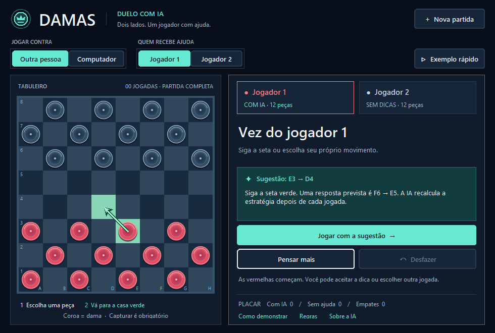

# Damas — Duelo com IA

**Disciplina:** Inteligência Artificial e Machine Learning  
**Autores do repositório original:** Jefferson Fagundes de Carvalho, Rodrigo Gomes de Carvalho e Michael Jonathan F. S. Fonseca

Uma partida completa de damas com **12 peças de cada lado**. Duas pessoas jogam no mesmo computador: uma recebe sugestões de um modelo de Machine Learning combinado com busca de jogadas; a outra escolhe seus movimentos sem recomendações. Também é possível jogar contra o computador.



As duas bases entregues têm **69.161 posições no total**. A base da rede neural contém **7.657 posições de partidas completas**: 4.885 para treino, 1.240 para validação e 1.532 para teste. Os **61.504 finais de duas ou três damas** são consultados como resultados exatos quando a partida chega a essa configuração. Esses registros são **posições de tabuleiro**, e não 69 mil jogadas de partidas reais. São tarefas distintas, documentadas em [data/README.md](data/README.md) e no [manifesto](data/manifesto.json).

### Neste README

- [Instalar e iniciar](#instalar-e-iniciar)
- [Abrir e jogar](#abrir-e-jogar)
- [Demonstrar em sala](#demonstrar-em-sala)
- [Como a ajuda funciona](#como-a-ajuda-funciona)
- [Bases de dados e treinamento](#bases-de-dados-e-treinamento)
- [Resultados medidos](#resultados-medidos)
- [Executar e reproduzir](#executar-e-reproduzir)
- [Organização do repositório](#organização-do-repositório)
- [Regras e estudos preservados](#regras-e-estudos-preservados)

## Instalar e iniciar

**Requisitos:** Windows 10/11, Python 3.12 com `pip` e acesso à internet apenas na primeira instalação das dependências. O projeto usa Tkinter, normalmente incluído na instalação do Python para Windows. É um aplicativo local; não exige conta, chave de API ou conexão para jogar depois de instalado.

1. Baixe o repositório pelo botão **Code → Download ZIP** do GitHub e extraia a pasta; ou clone pelo terminal:

   ```powershell
   git clone https://github.com/JeffersonFagundess/projeto-de-ia.git
   cd projeto-de-ia
   ```

2. No Explorador de Arquivos, abra **`iniciar_interface.bat`**. Ele cria `.venv`, instala as versões declaradas em `requirements.txt` e inicia o jogo. A primeira execução pode levar alguns minutos. As seguintes reutilizam o ambiente.
3. Se preferir o terminal, dentro da pasta do projeto execute:

   ```powershell
   py -3.12 -m venv .venv
   .\.venv\Scripts\python.exe -m pip install -r requirements.txt
   .\.venv\Scripts\python.exe app_gui.py
   ```

O modelo treinado, os dois CSVs e os recursos visuais já estão no repositório. **Não é necessário gerar dados nem treinar novamente para jogar.** Se o arquivo `.bat` informar erro, confira `py -3.12 --version` e repita os comandos do terminal para ver a mensagem completa da instalação.

## Abrir e jogar

O modo **Outra pessoa** permite duas pessoas no mesmo computador. O modo **Computador** coloca uma pessoa contra o programa. Em ambos, escolha **Jogador 1** ou **Jogador 2** em **Quem recebe ajuda** antes de começar.

1. Em **Jogar contra**, selecione **Outra pessoa**.
2. Em **Quem recebe ajuda**, escolha qual jogador receberá dicas. O jogador 1 controla as vermelhas e começa; o jogador 2 controla as pretas.
3. Clique numa peça e, depois, numa casa verde. A tela identifica a vez, as cores e as peças restantes.
4. Na vez do jogador **Com IA**, uma seta mostra a sugestão. Ele pode clicar em **Jogar com a sugestão** ou escolher outro movimento.
5. Na vez do jogador **Sem dicas**, a sugestão desaparece e os comandos de ajuda ficam bloqueados. Casas verdes continuam indicando movimentos legais para ambos.
6. Use **Desfazer** para experimentar outro caminho ou **Nova partida** para recomeçar. No modo contra o computador, desfazer retorna à última decisão humana.
7. Em uma posição difícil, use **Pensar mais** antes de jogar: a ajuda analisa por até 8 segundos, com limite de 18 turnos. Essa opção não sorteia alternativas; busca a melhor nota encontrada. A seta já aparece automaticamente.

Trocar o modo ou o lado assistido inicia uma nova partida. O placar acumula resultados das partidas concluídas enquanto a janela permanece aberta; desfazer uma vitória remove esse resultado. O exemplo preparado não conta no placar.

A interface usa fundo azul escuro, destaque ciano para a assistência e peças vermelhas e pretas com contornos distintos. Casas verdes indicam caminhos e destinos; a coroa identifica uma dama. Botões e seletores também aceitam Tab e Enter ou espaço. As cores e os componentes ficam separados das regras, em `ui/theme.py` e `ui/widgets.py`. Os desenhos das peças e do ícone são gerados localmente por `python -m scripts.gerar_recursos_interface` e já vêm incluídos no projeto.

## Demonstrar em sala

Clique em **Exemplo rápido** para mostrar uma captura em sequência num tabuleiro preparado. Depois, clique em **Nova partida** para o duelo completo. O botão **Como demonstrar** explica o roteiro dentro do aplicativo. Consulte também [o roteiro de apresentação](docs/DEMONSTRACAO.md).

A IA ajuda a decidir, mas não garante vitória. O placar registra o resultado real: vitórias de qualquer lado e empates. Para comparar participantes, troquem quem recebe ajuda entre partidas.

## Como a ajuda funciona

O modelo atual é uma **rede neural de regressão com camadas de 48 e 24 neurônios**. Ele aprendeu a estimar a vantagem de uma posição usando exemplos de partidas completas. No jogo, o assistente combina essa rede com avaliação de material, mobilidade, proteção, promoção e aproximação das damas em finais. A contribuição da rede é simetrizada e limitada: o resultado é um sistema híbrido de ML, estratégia e busca.

A busca tem profundidade máxima de **12 turnos** e extensão de sequências de captura até uma posição sem captura obrigatória. A ajuda usa **3 segundos na abertura**, **4 segundos com 9 a 16 peças** e **5 segundos com até 8 peças**. O computador usa sempre **1,5 segundo**. A ajuda tem mais tempo de análise por escolha explícita do projeto; o computador não foi enfraquecido. A busca usa tabuleiros compactos, ordenação de lances e reaproveitamento de posições, preservando o contexto de repetição e falta de progresso. Não resolve a árvore inteira da partida.

Nos primeiros oito turnos, a sugestão pode variar entre jogadas avaliadas na mesma profundidade com diferença máxima de 6 pontos (um peão vale 100). O computador também desempata entre jogadas de mesma nota, com margem zero. As notas das alternativas elegíveis são verificadas: um resultado incompleto de poda não serve para o sorteio. Uma vitória forçada encontrada não é trocada por uma opção inferior para produzir variedade.

Quando restam duas ou três peças e todas são damas, o assistente consulta os resultados resolvidos e a distância até o desfecho derivada deles. Ele escolhe a vitória mais curta, prolonga uma derrota inevitável ou mantém o empate. Essa decisão dispensa a busca limitada nesse final específico e verifica se a próxima jogada causaria empate por repetição ou falta de progresso. O histórico anterior ainda pode alterar a viabilidade de uma vitória anunciada pela tabela.

Somente o lado escolhido recebe sugestões. No modo **Computador**, o adversário usa a mesma busca e profundidade máxima, com avaliação tradicional de peças e avanço e **1,5 segundo por jogada**, sem o modelo aprendido ou consulta aos finais resolvidos. Esse modo não representa uma pessoa sem assistência.

## Bases de dados e treinamento

| Arquivo no repositório | Registros | Conteúdo | Papel no aplicativo |
| --- | ---: | --- | --- |
| [data/raw/partidas_completas/posicoes_completas.csv](data/raw/partidas_completas/posicoes_completas.csv) | **7.657** | Posições extraídas de 240 partidas legais simuladas, com até 24 peças. | Treinar e avaliar a rede neural que estima vantagem. |
| [data/raw/finais/finais_damas.csv](data/raw/finais/finais_damas.csv) | **61.504** | Todas as posições catalogadas do estudo com duas ou três damas, seu turno e resultado resolvido. | Consulta direta quando a partida chega a um desses finais. |
| **Total** | **69.161** | Duas bases para tarefas diferentes. | Os 61.504 finais **não** são acrescentados aos 4.885 exemplos de treino da rede. |

O CSV de partidas completas informa o identificador da partida, o turno, a divisão (`treino`, `validacao` ou `teste`), as casas de cada cor, as damas, a vez, 16 características e a nota produzida pela busca que serve de alvo. O CSV de finais tem 32 colunas para as casas escuras, `vez` e `resultado` (`win`, `loss` ou `draw` **para quem joga naquela posição**). Portanto, uma linha descreve um estado do tabuleiro; não é uma jogada registrada de uma pessoa.

O arquivo [data/manifesto.json](data/manifesto.json) guarda a contagem, a finalidade e o hash SHA-256 de cada CSV. `python -m scripts.auditar_dados` confere o conteúdo entregue, as divisões e esses hashes. A [documentação dos dados](data/README.md) descreve a origem e cada campo em mais detalhes.

### Processo de treinamento

1. O projeto gera partidas legais com políticas variadas e extrai posições sem colocar a mesma partida em divisões diferentes.
2. Uma busca tática de profundidade 2, com extensão de capturas, atribui uma **nota de vantagem** a cada posição. Essa nota é o alvo da regressão; não é o vencedor definitivo.
3. As características são calculadas para os dois lados. Posições equivalentes por rotação de 180° e troca das cores são deduplicadas.
4. A comparação de candidatos usa somente o conjunto de validação. O teste separado mede o modelo escolhido. O artefato pronto está em [models/partidas_completas/assistente_completo.npz](models/partidas_completas/assistente_completo.npz).
5. Durante o jogo, a rede **não retreina**. Sua nota complementa a avaliação estratégica e a busca. A tabela de finais é usada apenas no domínio de duas ou três damas.

| Item | Experimento atual |
| --- | --- |
| Problema | Aprender uma avaliação de posições para apoiar a escolha de jogadas. |
| Base | **7.657 posições** extraídas de **240 partidas simuladas**, com 2 a 24 peças. |
| Origem | Partidas legais geradas pelo próprio projeto, com políticas variadas. Não são partidas humanas coletadas. |
| Features | 16 medidas: peões, damas, avanço, centro, bordas, retaguarda, proteção e ameaça, para ambos os lados. |
| Alvo | Nota tática gerada por uma busca de profundidade 2 com extensão de capturas. É uma estimativa de vantagem, não o resultado definitivo da partida. |
| Hipótese | Um modelo pode aproximar a avaliação tática melhor que prever sempre a média. |
| Divisão | 4.885 posições de treino, 1.240 de validação e 1.532 de teste. |
| Prevenção de vazamento | Cada partida pertence a uma única divisão. Posições equivalentes por rotação de 180° com troca de cores são deduplicadas antes da divisão. |
| Seleção | Regressão Ridge e duas redes neurais comparadas pelo erro absoluto médio na validação. O teste fica reservado para avaliar o modelo escolhido. |

O modelo **não aprende novas partidas durante o uso**. Para incorporar novos exemplos, é necessário gerar dados e treinar novamente. A nota aprendida não é apresentada como probabilidade de vitória.

## Resultados medidos

No teste separado, o erro absoluto médio foi **96,00 pontos**, contra **322,59** da referência que prevê a média. O R² foi **0,855**. Essas medidas avaliam a aproximação da nota do professor; não são porcentagens de vitórias.

No ensaio da versão atual contra o **Computador da própria interface**, seguimos as sugestões em todas as jogadas do lado assistido e alternamos as cores. O limite foi de 180 turnos por partida. Os tempos foram os mesmos da interface: de 3 a 5 segundos para a ajuda conforme a fase e 1,5 segundo para o computador.

| Ajuda para | Semente | Resultado | Turnos |
| --- | ---: | --- | ---: |
| Vermelhas | 20261009 | Inconclusa no limite | 180 |
| Pretas | 20261010 | Vitória da ajuda | 70 |

As jogadas, notas, profundidades e condições de cada partida estão no [JSON do ensaio](reports/partidas_completas/assistente_vs_computador.json), com leitura rápida em [revisao_busca.md](reports/partidas_completas/revisao_busca.md). Uma partida sem desfecho no limite permanece **inconclusa**, mesmo que um lado tenha mais peças. O tempo de análise e o hardware podem alterar o resultado. A opção `--segundos 1.5` no avaliador força o mesmo tempo para os dois lados em uma comparação controlada.

Em um ensaio **anterior**, a versão antiga de ML e busca venceu 24 de 24 partidas contra dois programas mais simples: um aleatório e outro que escolhe por material imediato. Esse resultado não mede o computador da interface atual. Nenhum desses ensaios demonstra vitória garantida contra pessoas nem isola a contribuição do modelo aprendido da estratégia, da busca ou do tempo adicional.

As métricas e condições completas estão em [reports/partidas_completas/assistente_completo.md](reports/partidas_completas/assistente_completo.md), `reports/partidas_completas/assistente_completo.json` e `reports/partidas_completas/duelo_simulado.json`.

## Executar e reproduzir

```powershell
py -3.12 -m venv .venv
.\.venv\Scripts\python.exe -m pip install -r requirements.txt
.\.venv\Scripts\python.exe app_gui.py
```

Em outros sistemas, use o Python 3.12 local no lugar de `.\.venv\Scripts\python.exe`; ele precisa incluir Tkinter. O iniciador `.bat` é específico do Windows.

```powershell
# Gerar a base de partidas completas e treinar
.\.venv\Scripts\python.exe -m scripts.treinar_assistente_completo

# Treinar novamente usando o CSV entregue
.\.venv\Scripts\python.exe -m scripts.treinar_assistente_completo --reutilizar

# Repetir o ensaio contra políticas simples
.\.venv\Scripts\python.exe -m scripts.avaliar_duelo

# Testar a versão atual contra o computador real da interface
.\.venv\Scripts\python.exe -m scripts.avaliar_assistente --partidas 4

# Conferir as 69.161 linhas, divisões e integridade dos CSVs
.\.venv\Scripts\python.exe -m scripts.auditar_dados

# Testes de desenvolvimento
.\.venv\Scripts\python.exe -m pip install -e ".[dev]"
.\.venv\Scripts\python.exe -m pytest -q
```

O ensaio usa limites de tempo; os resultados podem variar com o computador. A geração de dados usa semente 2026, e o treinamento usa semente 42.

## Organização do repositório

```text
projeto_ia/
  damas/
    full_game.py   regras da partida e histórico
    match.py       quem recebe ajuda e quem joga automaticamente
    learning.py    características e avaliação pelo modelo treinado
    strategy.py    avaliação híbrida de estratégia e rede neural
    assistant.py   configuração compartilhada pela interface e pelo ensaio
    endgame_table.py consulta aos finais resolvidos
    opponent.py    busca de jogadas e respostas
    search_board.py representação compacta usada pela busca
    ...            experimento anterior de finais de damas
  ui/
    app.py         duelo, controles, turnos e placar
    board.py       desenho, cliques e animação
    theme.py       paleta, tipografia e barra de título
    widgets.py     botões, seletores e janelas de ajuda
    identity.py    ícones e identidade no Windows
    options.py     escolha visual de caminhos de captura
    assets/        ícones e desenhos das peças
    study.py       demonstração anterior de finais
  expert/          sistema especialista do repositório original
data/raw/finais/              base exata de 61.504 posições
data/raw/partidas_completas/ base de 7.657 posições simuladas
data/manifesto.json          inventário e hashes de integridade
models/finais/               classificador do estudo anterior
models/partidas_completas/   rede neural usada nas sugestões
reports/finais/              métricas e figuras do estudo anterior
reports/partidas_completas/  métricas do modelo e partidas avaliadas
docs/              roteiro da apresentação, arquitetura e imagem da interface
scripts/           geração, treinamento e avaliação reproduzíveis
tests/             regras, modelo, dados e controle da assistência
```

Veja [docs/ARQUITETURA.md](docs/ARQUITETURA.md) para o fluxo dos componentes e a separação das bases.

## Regras e estudos preservados

Usamos **damas inglesas**: peças comuns andam e capturam para a frente; damas andam uma casa para frente ou para trás. Captura é obrigatória e promoção encerra o turno. O jogo encerra por falta de peças/movimentos, terceira repetição da posição ou 40 jogadas por lado sem captura nem avanço de peão. A variante difere das damas brasileiras. Referência: [regras da WCDF](https://wcdf.net/rules/rules_of_checkers_english.pdf).

O estudo anterior de finais com até três damas continua preservado: **61.504 posições**, `models/finais/damas.joblib`, `reports/finais/metricas.json` e `reports/finais/resultado.md`. O classificador desse estudo não é usado nas sugestões da partida completa; seus rótulos exatos são consultados somente em finais de duas ou três damas. Abra a interface do estudo com `python -m projeto_ia.ui.study`.

O sistema especialista original também foi preservado: `python app_gui_regras.py` abre sua interface; `python app.py` abre o terminal.
